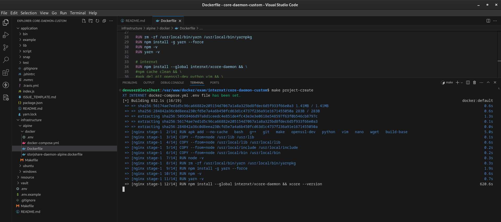

<div style="width:100%;float:left;clear:both;margin-bottom:0px;">
    <a href="https://github.com/pabloripoll?tab=repositories" style="width:auto;float:right;">
        
    </a>
</div>

# XCore Dev Test Stage

## Infrastructure

Aplication

- Alpine: 3.9
- NodeJS: 10.16.3
- Python: 2.7

## XCore

The aim to this repository is to test XCore running on NodeJS version 10.

## Automation commands

Copy the enviroment variables from [.env.example](.env.example) as `.env` file to run the automated commands in the provided root Makefile
```bash
# REMOVE COMMENTS WHEN COPY THIS FILE

# Leave it empty if no need for sudo user to execute docker commands
DOCKER_USER=sudo

# Container data for docker-compose.yml

PROJECT_NAME="XT INTERNET"              # <- this name will be prompt for automation commands
PROJECT_ABBR="in-proj"                  # <- part of the service image tag - useful if similar services are running
PROJECT_HOST="127.0.0.1"                # <- for this project is not necessary

BACKEND_OSCS="alpine"                   # <- container image key to manage docker image created
BACKEND_IMGK="-ngxnjs"                  # <- container image key to manage docker image created
BACKEND_PORT="8892"                     # <- local machine port opened for container service
BACKEND_CAAS="in-restful"               # <- container name to build the service
BACKEND_BIND="../../../application"     # <- path where application is binded from container to local
```

Makefile commands
```bash
$ make help
usage: make [target]

targets:
Makefile  help                   shows this Makefile help message
Makefile  hostname               shows local machine ip
Makefile  fix-permission         sets project directory permission
Makefile  host-check             shows this project ports availability on local machine
Makefile  project-set            sets the project enviroment file to build the container
Makefile  project-create         creates the project container from Docker image
Makefile  project-start          starts the project container running
Makefile  project-stop           stops the project container but data won't be destroyed
Makefile  project-destroy        removes the project from Docker network destroying its data and Docker image
Makefile  backend-ssh            enters the frontend container shell
Makefile  backend-dev            creates development enviroment
Makefile  backend-update         updates the frontend application into container
Makefile  repo-flush             clears local git repository cache specially to update .gitignore
Makefile  repo-commit            echoes common git commands
```

## Installation

*this repository only has been tested only on Alpine*

Create container
```bash
$ make create-project
```

Access to machine to run the application
```bash
$ make backend-ssh
```

## Issue

Keeps to much time installing `npm internxt/xcore-daemon`. Without this package the container works but trying to install it from inside container, the package needs permissions to be downloaded.

<div style="width:100%;float:left;clear:both;margin-bottom:50px;">
    
</div>

